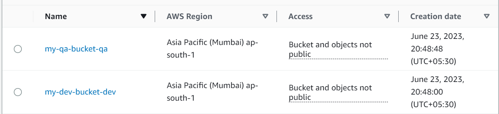

# Terraform Workspaces

### What is Terraform

Terraform is an infrastructure as code tool that lets you build, change, and version cloud and on-prem resources safely and efficiently.

### Terraform Workspaces 

To manage multiple environmets we can use terraform workspaces with tfvars file to create variable configuration that will contain configuration specific to environmets.

Here we are creating two s3 buckets  using file configuration and while building we can refer to tfvar file specific to environmets and can apply the configuration.

1. Create a new workspaces
```
terraform workspace new <workspace-name>

```

2. Select create workspace

```
terraform workspace select <workspace-name>
```





## Installation


1. Clone github repo
```
git clone https://github.com/gshr/terraform-workspaces.git
```

2. Initialize terraform
```
terraform init
```
3. Create new workspaces
```
terraform workspace new dev
terraform workspace new qa
```
4. Build infra on dev 
```
terraform workspace select dev
terraform apply -var-file="dev-env.tfvars"
```
5. Build infra on qa
```
terraform workspace select qa
terraform apply -var-file="qa-env.tfvars"
```